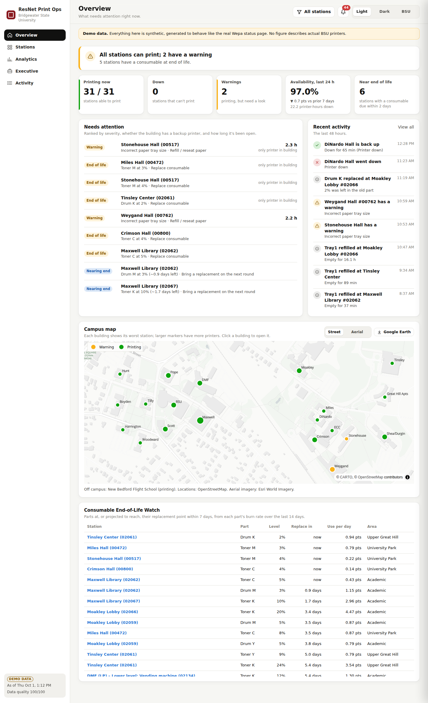
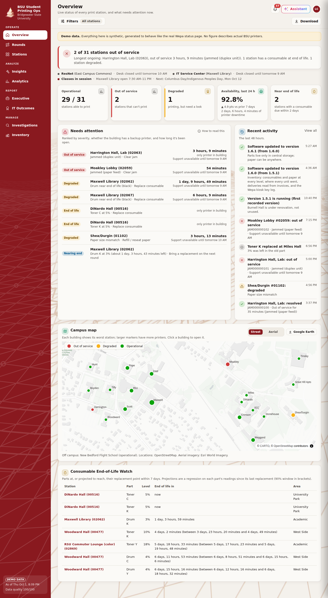
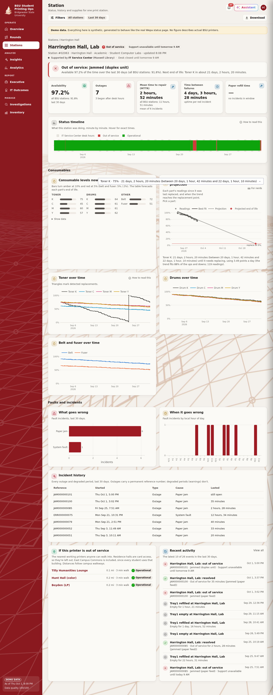
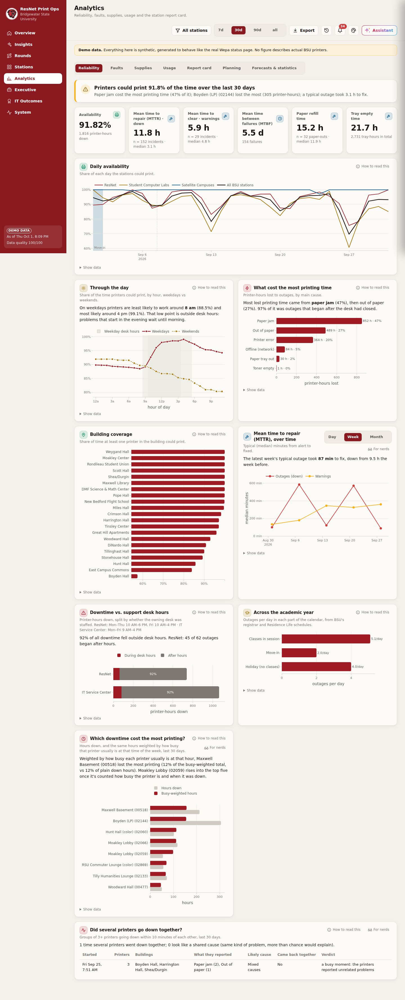
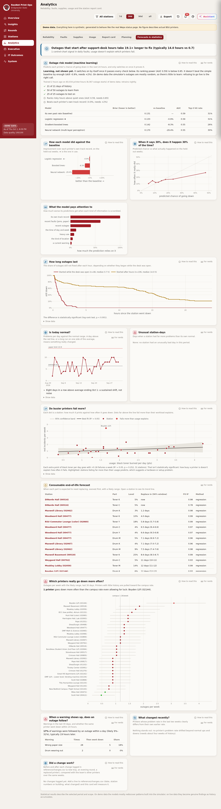
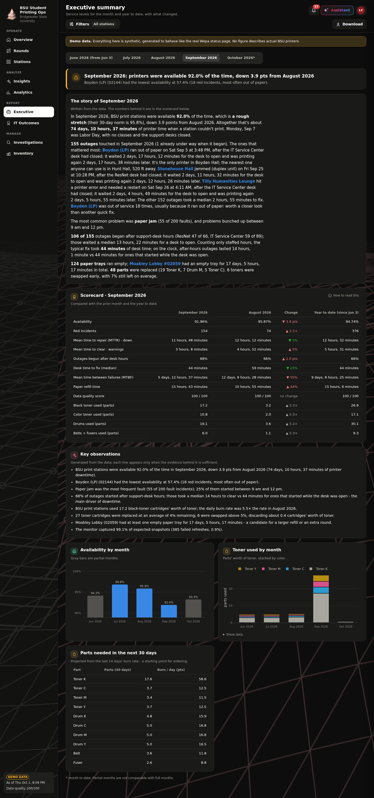
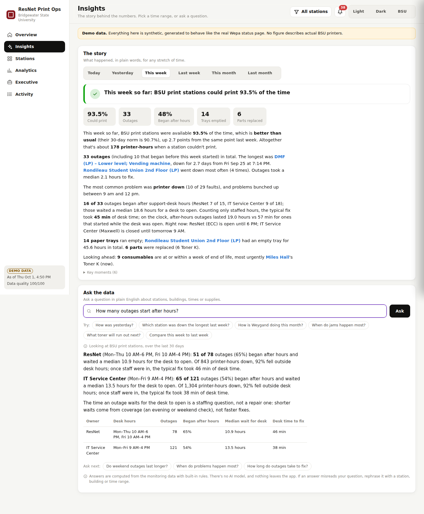
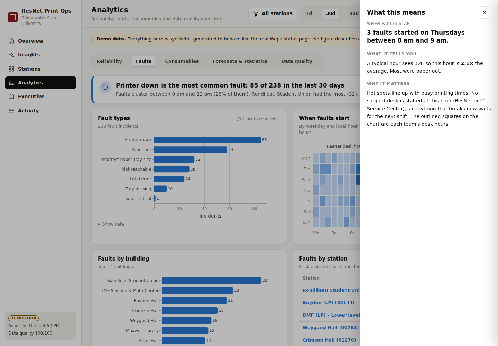
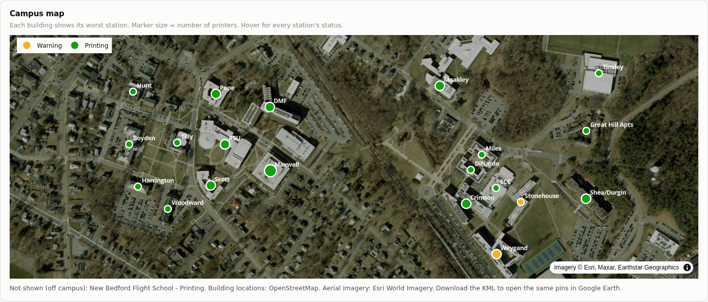

# ResNet Print Ops — Wepa Print Station Monitor

A monitoring and analytics dashboard for the Wepa print stations at Bridgewater State University.
It was first written as a terminal script for ResNet Support Representatives (see `legacy/`). This
version adds minute-by-minute data capture, documented KPI/KRI definitions, and a styled web dashboard
for operations staff, management and executives.

**Data source:** the public Wepa status page,
[`cs.wepanow.com/000BRIDGEW149.html`](https://cs.wepanow.com/000BRIDGEW149.html&filter=), which refreshes
every 60 seconds. As of October 2026 it lists 31 stations: ResNet (16), Student Computer Labs (14) and
Satellite Campuses (1).

| Overview (light) | Overview (BSU theme) | Station drill-through (BSU) |
|---|---|---|
|  |  |  |

| Analytics (BSU) | Forecasts & statistics (BSU) | Executive summary (dark) |
|---|---|---|
|  |  |  |

| Insights: the story of the week, and Ask the data | Click any point: what it means |
|---|---|
|  |  |



*Screenshots use the synthetic demo data set (see [Demo mode](#demo-mode)).*

---

## Quick start (macOS)

You need **Python 3.11 or newer**. Check with `python3 --version` in Terminal. If it's older or
missing, install the latest Python from [python.org/downloads](https://www.python.org/downloads/) or
with Homebrew (`brew install python`).

**One-time setup** (in Terminal):

```bash
git clone https://github.com/NickFreberg/Wepa-Monitor.git
cd Wepa-Monitor
python3 -m venv .venv
source .venv/bin/activate
pip install -r requirements.txt
```

**Use it with live data**: one command collects a snapshot every minute *and* runs the dashboard, then
opens it in your browser at http://127.0.0.1:8050:

```bash
cd Wepa-Monitor
source .venv/bin/activate
caffeinate -i python -m wepa_monitor start
```

Leave that Terminal window open; press `Ctrl+C` to stop. `caffeinate -i` (built into macOS) stops the
Mac from sleeping while it runs. With the lid closed a Mac still sleeps unless it's plugged in with an
external display. Data is saved in `data/live/`, so stopping and restarting picks up where it left
off; the gap simply shows as unobserved time.

The Operations page and map are useful immediately. The Management and Executive pages fill in as
history builds: about a day for meaningful numbers, a few days for trends.

**Explore with demo data**: 120 days of realistic synthetic history. These are two separate steps:
`demo` only *generates* the data (about 90 seconds, then it exits); `dashboard --demo` is what serves
the web page.

```bash
python -m wepa_monitor demo              # step 1: generate the data (one time)
python -m wepa_monitor dashboard --demo  # step 2: start the dashboard; your browser opens when it's ready
```

If the browser doesn't open by itself, go to http://127.0.0.1:8050. Keep the Terminal window open
while you use the dashboard; `Ctrl+C` stops it.

**Each time you come back**, open Terminal and run the three lines under "Use it with live data".

<details>
<summary>Windows</summary>

Use `python` instead of `python3`, activate with `.venv\Scripts\activate`, and drop `caffeinate -i`
(use *Settings → System → Power* to keep the PC awake).
</details>

<details>
<summary>All commands</summary>

| Command | What it does |
|---|---|
| `start` | Collect every minute and run the dashboard in one window; opens your browser |
| `collect` | Collect only, every minute (add `--archive-html` to keep raw pages for re-parsing) |
| `dashboard [--demo]` | Dashboard only, on live or demo data |
| `scrape` | One snapshot, for cron or a cloud timer |
| `demo [--days N]` | Generate synthetic history into `data/demo/` |
| `kml [--demo]` | Building pins with current status, for Google Earth |
| `compact` | Convert finished days' CSV to Parquet (`collect`/`start` do this daily) |

Run the tests with `pytest`.
</details>

## Using the dashboard

The sidebar has six sections. Each page opens with a **one-sentence summary** (green, amber or red),
so the main point comes before any chart.

**Explore the data to understand more.** The detail is there when you want it, without crowding the
page:

- **Click any point** on a chart (a day on the availability line, a fault bar, a square on the
  heatmap, a stretch of a station's timeline, a curve on the survival chart) and a side panel explains
  it in plain words: *what it is*, *what it tells you*, *why it matters*, and where to look next.
  Hover still gives the exact numbers. Esc closes the panel.
- **"ⓘ How to read this"** on a card opens a two-line guide to that chart.
- A **tip line** at the top of each page says so; dismiss it once and it stays hidden.

- **Overview:** what needs attention now. Live counts, a ranked "Needs attention" list, recent
  activity, the campus map (street or aerial; click a building to open it; export to Google Earth),
  and the **Consumable End-of-Life Watch** (parts at or nearing their replacement point within 7 days).
  Refreshes every minute.
- **Insights:** the **story** of today, yesterday, this week, last week, this month or last month,
  written as a short narrative with key figures and key moments. It covers how the period compared
  with normal, what went down and for how long, patterns, whether problems started while a support
  desk was open, supplies, and what's coming up. Below it, **Ask the data**: type a question such as
  "Which station was down the longest last week?", "How is Weygand doing this month?", "How many
  outages start after hours?" or "Is the ResNet desk open?" and get an answer computed from the data.
  It is rule-based (time phrases, station / building / area / owner names and a few dozen intent
  keywords), so it uses **no AI model and no tokens**, and it says what it understood ("Looking at
  Weygand Hall, last week") so a misreading is obvious.
- **Stations:** every printer, grouped by area, with search ("Weygand", "02061", "Academic") and a
  status filter (down, warning, needs attention). Every card opens the station's page.
- **Station page (drill-through):** current status in a sentence; availability, times down, time to
  fix and time between failures, each compared with all BSU print stations; who supports it and whether that desk is open now; a minute-by-minute **status
  timeline**; consumable levels now and over time, with replacements marked; fault mix by type and hour
  of day; full incident history; the other printers in the building (students' backup); and the
  station's activity.
- **Analytics:** tabs for **Reliability** (availability, time to fix, building coverage, station
  scorecard), **Faults** (types, when, where), **Consumables** (use per day, week, month or year;
  cumulative use; replacement log), **Forecasts & statistics** (see below) and **Data quality**.
- **Executive:** the story of the month in a paragraph, then month vs prior month vs year to date
  (including the share of outages that began after desk hours and the desk time to fix), key
  observations, monthly trends and a 30-day parts forecast.
- **Activity:** a searchable log of everything that happened, grouped by day: stations going down or
  recovering, warnings, parts replaced, trays emptied and refilled, monitoring gaps.

**Top bar**, available on every page:
- **Scope:** pick sections or areas once, and every page reports on just those stations.
- **Period:** 7, 30, 90 days or all time, on Analytics, Activity and station pages.
- **Notifications (bell):** stations going down or coming back, and monitoring gaps from the last 72
  hours. Unread items are grouped under *New*, and "Mark all read" clears the badge.
- **Theme:** **Light**, **Dark** or **BSU**. The BSU theme uses the crimson (#89191F) and warm
  neutrals from bridgew.edu's own stylesheets. Its chart colors (crimson, gold, BSU blue, green) were
  checked for color-blind safety as a set. Toner and drum charts keep their ink colors in every theme,
  because there the color is the meaning.

Charts include a **Show data** table, and status is always shown with an icon and a label as well as
color.

## Support ownership and desk hours

Each station belongs to a support team, and a team can only fix things while its desk is staffed:

| Owner | Based at | Desk hours | Stations |
|---|---|---|---|
| **ResNet** | East Campus Commons (ECC) | Mon–Thu 10 AM–6 PM, Fri 10 AM–4 PM | ResNet section (residence halls) |
| **IT Service Center** | Maxwell Library | Mon–Fri 9 AM–4 PM | Student Computer Labs and Satellite Campuses |

Every outage is classified against its owner's hours. It is recorded as either *began during desk
hours* or *began after hours*. For after-hours outages, the time spent waiting for the desk to open is
recorded too. Each outage's downtime is then split into **staffed** and **after-hours** time. This
drives:
- the overview's desk status and the "closed until…" notes on Needs attention;
- the station page's shaded desk hours on the timeline;
- the outlined desk hours on the faults heatmap;
- the *Downtime vs. support desk hours* chart and table;
- the Kaplan–Meier comparison;
- the executive scorecard rows;
- the stories and Ask answers.

**Desk time to fix** counts only staffed minutes, so it measures response once someone is in. MTTR
also includes the wait. The ownership mapping, hours and closed dates (holidays and breaks) are in
`config.py` (`SUPPORT_TEAMS`, `SECTION_OWNER`, `SUPPORT_CLOSED_DATES`).

## Forecasts and statistical models

`wepa_monitor/models.py`, shown on **Analytics → Forecasts & statistics** and on each station page:

| Model | Question it answers | Method |
|---|---|---|
| **Consumable end-of-life** | When will this toner, drum, belt or fuser hit its replacement point? | **Theil–Sen regression** (median of pairwise slopes, robust to sensor blips) on the part's readings since its last replacement. The slope's 90% confidence interval gives an earliest–latest window. Falls back to the simple burn rate when there are too few readings. Feeds the Overview's End-of-Life Watch and each station's scatter plot with its fitted line. |
| **Fault control chart** | Is today's fault count normal, or has something changed? | **Statistical process control c-chart**: daily fault incidents against limits at the average ± 3√average, plus the Western Electric run rule (8 days in a row on one side). Station-days far above that station's own average are flagged with a **Poisson tail test** (p < 0.001). |
| **Time to fix** | What share of outages are fixed within 1, 4 or 12 hours, started during desk hours vs after hours? | **Kaplan–Meier survival curves**, with outages still open kept as *censored* observations rather than dropped, and a **log-rank test** for whether the two groups differ. |
| **Usage vs reliability** | Do busier printers fail more, or are some units just bad? | **Ordinary least squares** of red incidents per week on usage (black toner burned per day), with R², p-value, a 95% confidence band, and stations whose residual exceeds 2σ flagged as failing more than their usage explains. |

Each model reports its sample size and shows "not enough data" when the evidence is thin. On demo data
the models mostly rediscover patterns built into the simulator; on live data their findings are real.
Time-series forecasting (ARIMA and similar) is deliberately left out until there's at least one full
academic year of live history, because semester seasonality can't be learned from a few months.

## How the data flows

```
Wepa status page ──(every 60 s)──► scrape.py ──► data/live/snapshots/YYYY-MM-DD.csv   (append-only)
                                        │                 └─► .parquet after the day ends
                                        └──────────────► data/live/scrape_log/…        (every attempt, ok or failed)

raw snapshots ──► events.py        observed time spans, red/yellow incidents, fault-code and tray incidents
              ──► consumables.py   change points → usage that survives replacements, replacement events
              ──► metrics.py       KPIs with evidence + quality gating
              ──► ops.py / insights.py   work queue, period comparisons, observations
              ──► dashboard/       Dash + Plotly
```

Raw snapshots are never edited. All metrics are derived from them, so a changed business rule can be
recomputed over the full history.

The parser finds columns **by header text**, not by position. If Wepa adds or reorders a column, the
scrape fails loudly and is logged as a failure, rather than putting values in the wrong fields.

## Metric definitions (the business rules)

All thresholds live in [`wepa_monitor/config.py`](wepa_monitor/config.py).

**Severity** comes from the status page itself: each row is colored green / yellow / red, and that
vendor verdict is used directly. Status codes (`Alert_paper_out_error`, `Alert_printer_down`,
`Alert_tray_missing`, …) give the fault type and the fix category ([`rules.py`](wepa_monitor/rules.py)).

**Observed time.** Each snapshot covers the time until the station's next snapshot, up to 5 minutes. A
longer gap is *unobserved*: it is never counted as up or as down, and it is excluded from availability.

| Metric | Definition |
|---|---|
| **Availability** | Observed printer-minutes not in red ÷ all observed printer-minutes. |
| **Building coverage** | Share of minutes in which *at least one* printer in the building could print (redundancy). |
| **Incident** | Consecutive snapshots of one station in the same state. Opens at the first snapshot showing it and resolves at the first snapshot that no longer does. Gaps under 6 h with the same state on both sides are bridged. |
| **MTTR · red / yellow** | Mean duration of resolved incidents at that severity. Incidents already open when monitoring began are excluded, because their start time is unknown. |
| **MTBF** | Printer-hours of uptime ÷ number of red incidents. |
| **Paper refill time** | Mean duration of `PAPER OUT` (the station cannot print). |
| **Tray empty time** | Mean duration of a single tray reporting *Paper Out Warning*, even while another tray keeps printing. |
| **Fault ranking** | Count of fault-code incidents by type, building, and weekday × local hour. |
| **Data quality score** | 30% freshness + 40% completeness (snapshots ÷ expected) + 20% validity (values in 0–100) + 10% station coverage. |
| **Refresh failure rate** | Failed scrape attempts ÷ all attempts. |

### Cumulative consumable usage (the replacement rule)

The page shows a *level* that falls toward 0 and jumps back up when a part is replaced. Usage is
counted like an odometer:

1. A rise of **≥ 15 points** between consecutive readings is a **replacement**. It is logged with the
   level the old part had left, and it is never counted as negative usage.
2. Between replacements, usage = first reading − **lowest reading so far**. Sensor jitter
   (51 → 50 → 51 → 50) is therefore counted once, not every time it wobbles.
3. Usage is summed across replacements; **100 points = one part's worth**.

| Time | Black toner | Counted as | Running total |
|---|---|---|---|
| 09:00 | 12% | — | 0 |
| 11:00 | 7% | usage +5 | 5 |
| 13:00 | 3% | usage +4 | 9 |
| 13:20 | 100% | **replacement** (3% left) | 9 |
| 16:00 | 94% | usage +6 | **15** |

Burn rate = usage ÷ days actually observed. Days to replacement = (level − replacement point) ÷ recent
burn rate (last 14 days).

### Quality gating

A metric is shown only when it rests on enough evidence: at least 3 incidents for a mean, at least 50%
of the window observed for a rate, and at least 3 observed days for a burn rate. Otherwise the tile is
grayed out with the reason ("only 2 incidents — low confidence"). Executive observations follow the same
rules and are left out when the evidence is thin.

## Demo mode

`python -m wepa_monitor demo` writes **synthetic** data in exactly the live format, for the real 31
stations, so the whole pipeline and dashboard run unchanged. The simulation includes:

- printing driven by hall/lab schedules, weekends and the academic calendar (quiet summer, busy finals);
- paper draining Tray1 then Tray2, refilled on staff rounds;
- toner, drums, belt and fuser depleting at realistic yields and replaced near their thresholds
  (occasionally early, which leaves stranded toner);
- jams, network drops and fatal errors; staff respond, and do refill rounds, only during the owning
  desk's real hours (ResNet or the IT Service Center), so after-hours problems wait for the next shift;
- scraper failures and a couple of multi-hour outages.

The data directory is stamped `"synthetic": true` and every page shows a **DEMO** banner. Nothing in
demo mode describes actual BSU printers.

## Hosting it permanently

**Azure App Service (recommended):** one command deploys the dashboard and the every-minute collector
to a Basic B1 Linux app (~$13/month) with HTTPS, Always On and optional Microsoft sign-in. See the
step-by-step guide in [`deploy/azure/README.md`](deploy/azure/README.md):

```bash
brew install azure-cli && az login
./deploy/azure/deploy.sh
```

**Anywhere else:** run `gunicorn --workers 1 --threads 8 wepa_monitor.wsgi:server`. It serves the
dashboard and collects every minute in the same process; set `WEPA_DATA_DIR` to a folder that
persists. Or run `python -m wepa_monitor start` on an always-on Mac, PC or Raspberry Pi.

**Scale:** about 45k snapshot rows per day (~16 million per year), stored as under 0.5 MB of Parquet
per finished day. Each finished day is rolled up once into hourly tables and state changes
(`wepa_monitor/rollup.py`), so the dashboard's memory stays roughly flat as history grows; only the
current day is reprocessed each minute.

## Station reference data and the map

- [`reference/stations.csv`](reference/stations.csv) maps each station ID to a **building** and an
  **area** (Upper Great Hill, University Park, West Side, Academic, …). Stations that appear on the page
  but not in the file still work; they show under "Unassigned". Rows marked "confirm" are best guesses
  from the page's descriptions. Wepa reuses station IDs: `00518` was Great Hill Apartments in the v1
  script and is now Maxwell Basement.
- [`reference/buildings.csv`](reference/buildings.csv) gives each building's **coordinates** (the
  centroid of its OpenStreetMap footprint, with the OSM way ID for traceability), a **short name** for map
  labels (ECC, DMF, RSU, …), and its campus. New Bedford Flight School uses the New Bedford Regional
  Airport centroid and is marked approximate.

The **campus map** on the Operations page shows each building at its worst station's status
(down / warning / no data / printing), sized by its number of printers. Hovering shows every station in
the building. Switch between a street basemap (CARTO / OpenStreetMap) and **aerial imagery** (Esri World
Imagery); neither needs an API key.

**Google Earth:** the *Open in Google Earth (.kml)* button on the Operations page downloads the current
pins, colored by status, with each station's detail in the pin balloon. The same file is available
from the command line:

```bash
python -m wepa_monitor kml -o bsu-print-stations.kml          # add --demo for the demo data
```

Open it in Google Earth Pro (*File → Open*), or import it from the *Projects* panel in Google Earth on
the web.

## Project layout

```
wepa_monitor/
  config.py        thresholds, paths, cadence: every business rule in one place
  rules.py         status codes → names, severity fallback, fix category; printer-text parsing
  scrape.py        fetch + header-driven parser
  store.py         append-only snapshots and scrape log; daily Parquet compaction
  rollup.py        per-day rollups (hourly coverage, state changes) cached so memory stays flat
  collector.py     the every-minute collection loop
  wsgi.py          production entry point: dashboard + collector (gunicorn)
  events.py        observation spans and incident detection (vectorized)
  consumables.py   replacement-aware usage
  metrics.py       KPI/KRI definitions with evidence and gating
  ops.py           current status and the ranked work queue
  activity.py      the event feed behind Activity and notifications
  models.py        end-of-life regression, control charts, survival analysis, usage regression
  geo.py           building-level map points and KML export for Google Earth
  insights.py      month / YTD scorecards and generated observations
  support.py       ownership, desk hours, and desk-hours vs after-hours splits of downtime
  narrative.py     plain-language stories for any period
  ask.py           "Ask the data": a rule-based question interpreter (no AI model)
  synth.py         demo-data simulator
  dashboard/       Dash app shell (app.py), views/ (one module per page), charts, stylesheet,
                   explain.py (the click-to-explain panels)
reference/stations.csv   station → building / area
reference/buildings.csv  building coordinates (OpenStreetMap), short names, campus
tests/                   parser, replacement rule, incident logic, desk hours, stories and Ask
legacy/                  the original v1 terminal script
```

## Roadmap

- **Route planner.** The work-queue score (severity × no-backup multiplier + age) is designed to feed a
  route optimizer (OR-Tools) over walking times between buildings, starting from a ResNet workstation,
  drawn on the campus map with a pick list ("2 reams, 1 black toner"). Building coordinates are in place;
  it still needs the ResNet workstation locations.
- Confirm the status codes not yet seen on the live page, and the yellow-alert behavior.
