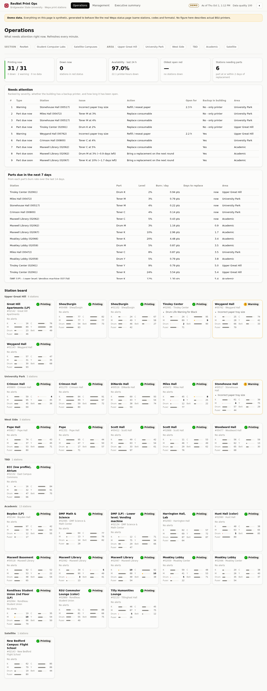
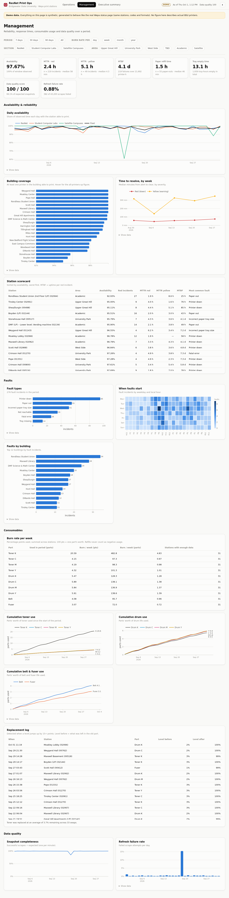

# ResNet Print Ops — Wepa Print Station Monitor

A monitoring and analytics dashboard for the Wepa print stations at Bridgewater State University.
It was first written as a terminal script for ResNet Support Representatives (see `legacy/`). This
version adds minute-by-minute data capture, documented KPI/KRI definitions, and a styled web dashboard
for operations staff, management and executives.

**Data source:** the public Wepa status page,
[`cs.wepanow.com/000BRIDGEW149.html`](https://cs.wepanow.com/000BRIDGEW149.html&filter=), which refreshes
every 60 seconds. As of October 2026 it lists 31 stations: ResNet (16), Student Computer Labs (14) and
Satellite Campuses (1).

| Operations | Management | Executive summary |
|---|---|---|
|  |  |  |

*Screenshots use the synthetic demo data set (see [Demo mode](#demo-mode)).*

---

## Quick start

```bash
python -m venv .venv && source .venv/bin/activate      # Windows: .venv\Scripts\activate
pip install -r requirements.txt

# Option A — demo: 120 days of realistic synthetic history (~90 s), then open http://127.0.0.1:8050
python -m wepa_monitor demo --days 120
python -m wepa_monitor dashboard --demo

# Option B — live: start collecting real snapshots, and run the dashboard alongside
python -m wepa_monitor collect          # leave running; one snapshot per minute
python -m wepa_monitor dashboard        # reads data/live, reloads as new snapshots land
```

Other commands: `scrape` (one snapshot, suited to cron or a cloud timer), `compact` (convert finished
days to Parquet), and `--archive-html` on `scrape`/`collect` to keep gzipped raw pages so they can be
re-parsed later. Run the tests with `pytest`.

## The three views

- **Operations** — what needs attention now. Live counts (printing / down / warning), a **ranked work
  queue**, parts due in the next 7 days, and a station board grouped by area showing every toner, drum,
  belt and fuser level. Refreshes every minute.
- **Management** — any period (7 / 30 / 90 days / all), filterable by section and area. Availability,
  MTTR (red and yellow), MTBF, paper refill time, tray-empty time, fault types by frequency, location and
  hour, burn rate per day/week/month/year for each consumable, cumulative usage, the replacement log,
  and data quality.
- **Executive summary** — month vs prior month vs year to date, observations generated from the data,
  monthly trends, and a 30-day parts forecast.

Each chart has a **Show data** table under it, and the light/dark theme follows the OS (◐ toggles it).

## How the data flows

```
Wepa status page ──(every 60 s)──► scrape.py ──► data/live/snapshots/YYYY-MM-DD.csv   (append-only)
                                        │                 └─► .parquet after the day ends
                                        └──────────────► data/live/scrape_log/…        (every attempt, ok or failed)

raw snapshots ──► events.py        observed time spans, red/yellow incidents, fault-code and tray incidents
              ──► consumables.py   change points → usage that survives replacements, replacement events
              ──► metrics.py       KPIs with evidence + quality gating
              ──► ops.py / insights.py   work queue, period comparisons, observations
              ──► dashboard/       Dash + Plotly
```

Raw snapshots are never edited. All metrics are derived from them, so a changed business rule can be
recomputed over the full history.

The parser finds columns **by header text**, not by position. If Wepa adds or reorders a column, the
scrape fails loudly and is logged as a failure, rather than putting values in the wrong fields.

## Metric definitions (the business rules)

All thresholds live in [`wepa_monitor/config.py`](wepa_monitor/config.py).

**Severity** comes from the status page itself: each row is coloured green / yellow / red, and that
vendor verdict is used directly. Status codes (`Alert_paper_out_error`, `Alert_printer_down`,
`Alert_tray_missing`, …) give the fault type and the fix category ([`rules.py`](wepa_monitor/rules.py)).

**Observed time.** Each snapshot covers the time until the station's next snapshot, up to 5 minutes. A
longer gap is *unobserved*: it is never counted as up or as down, and it is excluded from availability.

| Metric | Definition |
|---|---|
| **Availability** | Observed printer-minutes not in red ÷ all observed printer-minutes. |
| **Building coverage** | Share of minutes in which *at least one* printer in the building could print (redundancy). |
| **Incident** | Consecutive snapshots of one station in the same state. Opens at the first snapshot showing it and resolves at the first snapshot that no longer does. Gaps under 6 h with the same state on both sides are bridged. |
| **MTTR · red / yellow** | Mean duration of resolved incidents at that severity. Incidents already open when monitoring began are excluded, because their start time is unknown. |
| **MTBF** | Printer-hours of uptime ÷ number of red incidents. |
| **Paper refill time** | Mean duration of `PAPER OUT` (the station cannot print). |
| **Tray empty time** | Mean duration of a single tray reporting *Paper Out Warning*, even while another tray keeps printing. |
| **Fault ranking** | Count of fault-code incidents by type, building, and weekday × local hour. |
| **Data quality score** | 30% freshness + 40% completeness (snapshots ÷ expected) + 20% validity (values in 0–100) + 10% station coverage. |
| **Refresh failure rate** | Failed scrape attempts ÷ all attempts. |

### Cumulative consumable usage (the replacement rule)

The page shows a *level* that falls toward 0 and jumps back up when a part is replaced. Usage is
counted like an odometer:

1. A rise of **≥ 15 points** between consecutive readings is a **replacement**. It is logged with the
   level the old part had left, and it is never counted as negative usage.
2. Between replacements, usage = first reading − **lowest reading so far**. Sensor jitter
   (51 → 50 → 51 → 50) is therefore counted once, not every time it wobbles.
3. Usage is summed across replacements; **100 points = one part's worth**.

| Time | Black toner | Counted as | Running total |
|---|---|---|---|
| 09:00 | 12% | — | 0 |
| 11:00 | 7% | usage +5 | 5 |
| 13:00 | 3% | usage +4 | 9 |
| 13:20 | 100% | **replacement** (3% left) | 9 |
| 16:00 | 94% | usage +6 | **15** |

Burn rate = usage ÷ days actually observed. Days to replacement = (level − replacement point) ÷ recent
burn rate (last 14 days).

### Quality gating

A metric is shown only when it rests on enough evidence: at least 3 incidents for a mean, at least 50%
of the window observed for a rate, and at least 3 observed days for a burn rate. Otherwise the tile is
greyed out with the reason ("only 2 incidents — low confidence"). Executive observations follow the same
rules and are left out when the evidence is thin.

## Demo mode

`python -m wepa_monitor demo` writes **synthetic** data in exactly the live format, for the real 31
stations, so the whole pipeline and dashboard run unchanged. The simulation includes:

- printing driven by hall/lab schedules, weekends and the academic calendar (quiet summer, busy finals);
- paper draining Tray1 then Tray2, refilled on staff rounds;
- toner, drums, belt and fuser depleting at realistic yields and replaced near their thresholds
  (occasionally early, which leaves stranded toner);
- jams, network drops and fatal errors, with response times that depend on whether a desk is staffed;
- scraper failures and a couple of multi-hour outages.

The data directory is stamped `"synthetic": true` and every page shows a **DEMO** banner. Nothing in
demo mode describes actual BSU printers.

## Running the collector somewhere permanent

The collector needs to run continuously, once a minute. Options:

- **Azure Functions** (timer trigger `0 */1 * * * *`) calling `python -m wepa_monitor scrape`, with
  `WEPA_DATA_DIR` on a mounted Azure Files share or synced to Blob Storage. This is the lowest-cost
  always-on option.
- **A small VM or a Raspberry Pi** running `python -m wepa_monitor collect` as a service.
- **cron**: `* * * * * cd /path && .venv/bin/python -m wepa_monitor scrape`.

Expect roughly 45k rows per day: a few MB of CSV for the current day, and under 0.5 MB per finished day as Parquet. `--archive-html` adds about 7 MB per day.

## Station reference data

[`reference/stations.csv`](reference/stations.csv) maps each station ID to a **building**, an
**area** (Upper Great Hill, University Park, West Side, Academic, …) and optional **lat/lon**. Stations
that appear on the page but not in the file still work; they show under "Unassigned". Rows marked
"confirm" are best guesses from the page's descriptions. Note that Wepa reuses station IDs: `00518` was
Great Hill Apartments in the v1 script and is now Maxwell Basement.

## Project layout

```
wepa_monitor/
  config.py        thresholds, paths, cadence: every business rule in one place
  rules.py         status codes → names, severity fallback, fix category; printer-text parsing
  scrape.py        fetch + header-driven parser
  store.py         append-only snapshots and scrape log; daily Parquet compaction
  events.py        observation spans and incident detection (vectorised)
  consumables.py   replacement-aware usage
  metrics.py       KPI/KRI definitions with evidence and gating
  ops.py           current status and the ranked work queue
  insights.py      month / YTD scorecards and generated observations
  synth.py         demo-data simulator
  dashboard/       Dash app, Plotly charts, stylesheet
reference/stations.csv   building / area / coordinates per station
tests/                   parser, replacement rule and incident logic (fixture: a real page capture)
legacy/                  the original v1 terminal script
```

## Roadmap

- **Route planner.** The work-queue score (severity × no-backup multiplier + age) is designed to feed a
  route optimiser (OR-Tools) over walking times between buildings, starting from a ResNet workstation,
  shown on a map with a pick list ("2 reams, 1 black toner"). It needs building coordinates and
  workstation locations in `reference/`.
- Confirm the status codes not yet seen on the live page, and the yellow-alert behaviour.
- Incremental metric updates for long live histories (currently a full reload each minute when new data
  arrives).
