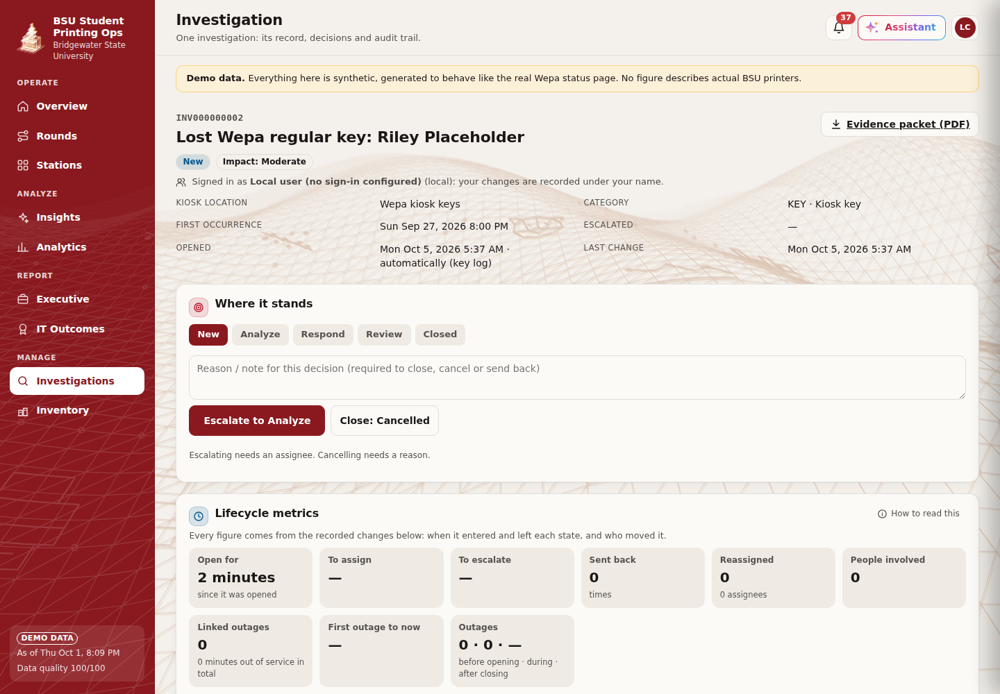
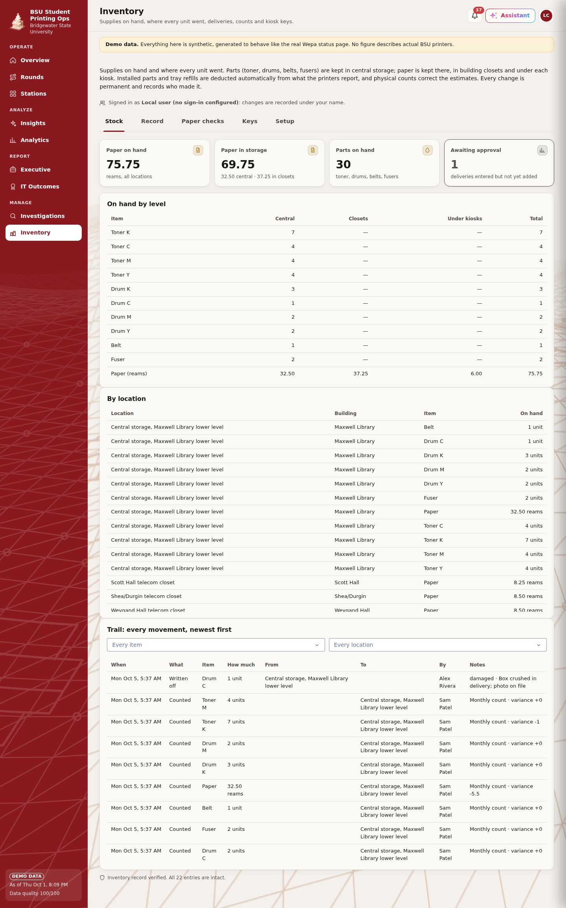
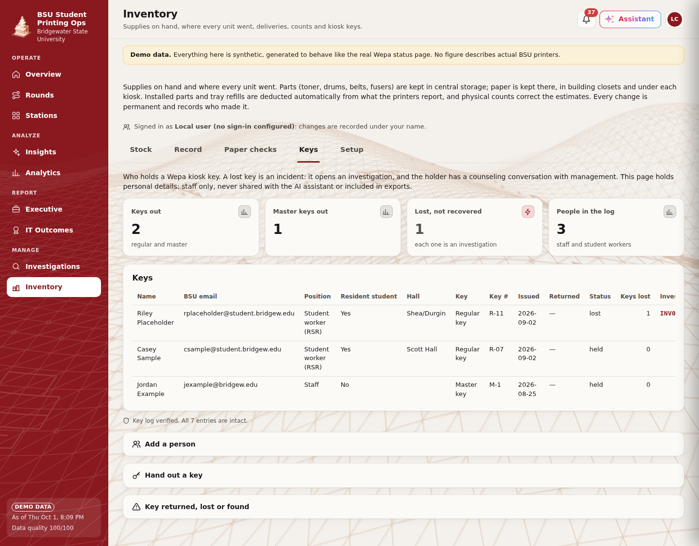
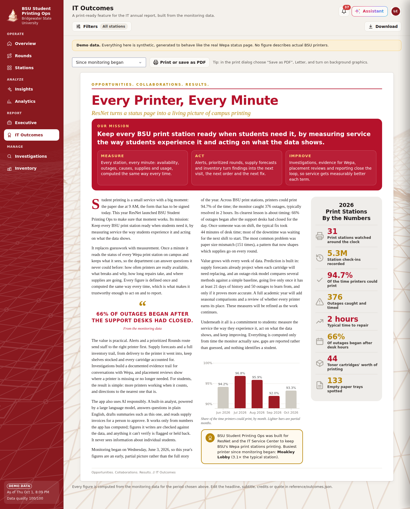
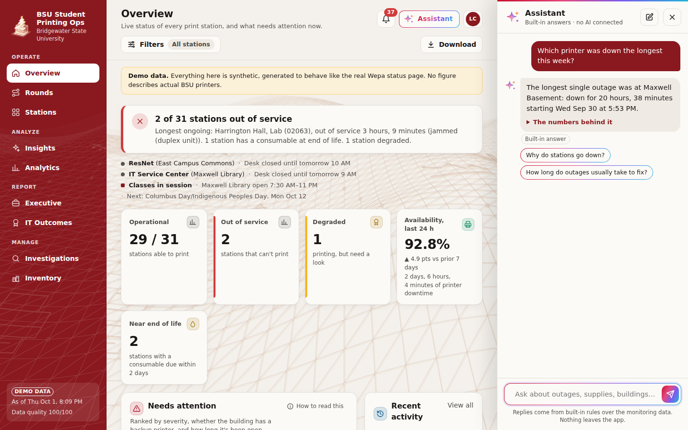
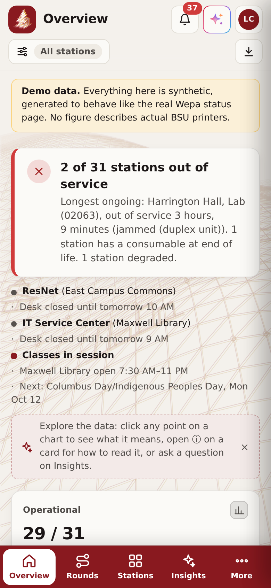
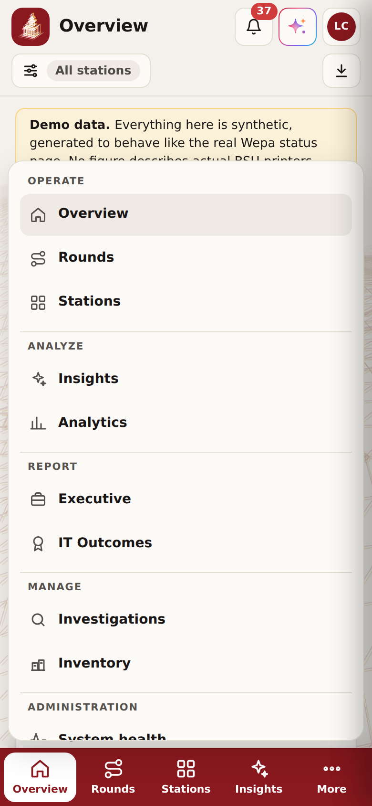
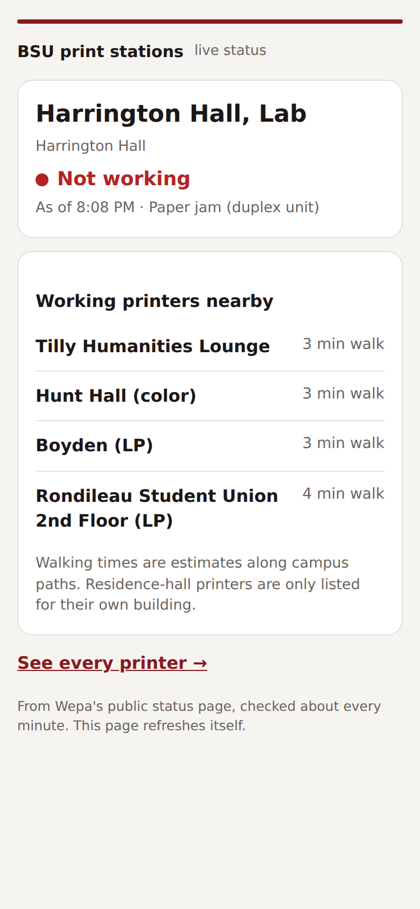

# BSU Student Printing Ops — Wepa Print Station Monitor

[](https://github.com/NickFreberg/Wepa-Monitor/actions/workflows/ci.yml)

**[Read the case study](docs/CASE_STUDY.md)**: the problem, the architecture, the decisions behind it,
and what's real vs demo data.

**[Product documentation (PDF)](docs/product/BSU-Student-Printing-Ops-Documentation.pdf)**: the full CRISP-DM
lifecycle, requirements, data dictionary, architecture, BPMN/CMMN/DMN models, user guide and standards
alignment ([HTML version](docs/product/BSU-Student-Printing-Ops-Documentation.html); rebuild with
`python docs/product/build.py --pdf`).

A monitoring and analytics dashboard for the Wepa print stations at Bridgewater State University.
It was first written as a terminal script for ResNet Support Representatives (see `legacy/`). This
version adds minute-by-minute data capture, documented KPI/KRI definitions, and a styled web dashboard
for operations staff, management and executives.

### At a glance

**Mission:** keep every BSU print station ready when students need it, by measuring service the way
students experience it and acting on what the data shows.

| Measure | Act | Improve |
|---|---|---|
| Every station, every minute: availability, outages, causes, supplies and usage, computed the same way every time. | Alerts, prioritized rounds, supply forecasts and inventory turn findings into the next visit, the next order and the next fix. | Investigations, evidence for Wepa, placement reviews and reporting close the loop, so service gets measurably better each term. |

| If you are… | Start here | You get |
|---|---|---|
| IT leadership | Executive summary · IT Outcomes | Service levels for the month and year, what changed, and a print-ready annual-report feature |
| A manager or supervisor | Overview · Analytics · Investigations · Inventory | What needs attention, the station report card, root-cause work with an audit trail, supply accountability |
| A data engineer or statistician | Analytics › Forecasts & statistics · System health | Stated definitions, sample sizes, confidence intervals, model back-tests, data-quality checks |
| A student worker | Overview · Rounds · Inventory › Record | The next printer to visit, the route, and where to record deliveries, moves and counts |
| A student | The student status page (QR sign on the printer) | Whether this printer works right now, and the nearest one that does |

The menu is grouped the same way: **Operate** (Overview, Rounds, Stations), **Analyze** (Insights,
Analytics), **Report** (Executive summary, IT Outcomes) and **Manage** (Investigations, Inventory), with
System health, Software and security and the Activity log in the account menu.

**Data source:** the public Wepa status page,
[`cs.wepanow.com/000BRIDGEW149.html`](https://cs.wepanow.com/000BRIDGEW149.html&filter=), which refreshes
every 60 seconds. As of October 2026 it lists 31 stations: ResNet (16), Student Computer Labs (14) and
Satellite Campuses (1).

| Overview (light) | Overview (BSU theme) | Station drill-through (BSU) |
|---|---|---|
|  |  |  |

| Analytics (BSU) | Forecasts & statistics, with the outage-risk model (BSU) | Executive summary (dark) |
|---|---|---|
|  |  |  |

| Insights: the story of the week, and Ask the data | Click any point: what it means |
|---|---|
|  |  |

| An investigation (governed lifecycle, audit trail, evidence packet) |
|---|
|  |

| Inventory: stock at every level and the trail of every unit | The kiosk key log |
|---|---|
|  |  |

| IT Outcomes: the launch-year stakeholder briefing |
|---|
|  |

| The Assistant pane | On a phone: tab bar, and More | Student status page (phone) |
|---|---|---|
|  |   |  |


*Screenshots use the synthetic demo data set (see [Demo mode](#demo-mode)).*

---

## Quick start (macOS)

You need **Python 3.11 or newer**. Check with `python3 --version` in Terminal. If it's older or
missing, install the latest Python from [python.org/downloads](https://www.python.org/downloads/) or
with Homebrew (`brew install python`).

**One-time setup** (in Terminal):

```bash
git clone https://github.com/NickFreberg/Wepa-Monitor.git
cd Wepa-Monitor
python3 -m venv .venv
source .venv/bin/activate
pip install -r requirements.txt
```

**Use it with live data**: one command collects a snapshot every minute *and* runs the dashboard, then
opens it in your browser at http://127.0.0.1:8050:

```bash
cd Wepa-Monitor
source .venv/bin/activate
caffeinate -i python -m wepa_monitor start
```

Leave that Terminal window open; press `Ctrl+C` to stop. `caffeinate -i` (built into macOS) stops the
Mac from sleeping while it runs. With the lid closed a Mac still sleeps unless it's plugged in with an
external display. Data is saved in `data/live/`, so stopping and restarting picks up where it left
off; the gap simply shows as unobserved time.

The Overview, Rounds and map are useful immediately. Analytics, Insights and Executive fill in as
history builds: about a day for meaningful numbers, a few days for trends.

**Explore with demo data**: 120 days of realistic synthetic history. These are two separate steps:
`demo` only *generates* the data (about 90 seconds, then it exits); `dashboard --demo` is what serves
the web page.

```bash
python -m wepa_monitor demo              # step 1: generate the data (one time)
python -m wepa_monitor dashboard --demo  # step 2: start the dashboard; your browser opens when it's ready
```

If the browser doesn't open by itself, go to http://127.0.0.1:8050. Keep the Terminal window open
while you use the dashboard; `Ctrl+C` stops it.

**Each time you come back**, open Terminal and run the three lines under "Use it with live data".

<details>
<summary>Windows</summary>

Use `python` instead of `python3`, activate with `.venv\Scripts\activate`, and drop `caffeinate -i`
(use *Settings → System → Power* to keep the PC awake).
</details>

<details>
<summary>All commands</summary>

| Command | What it does |
|---|---|
| `start` | Collect every minute and run the dashboard in one window; opens your browser |
| `collect` | Collect only, every minute (add `--archive-html` to keep raw pages for re-parsing) |
| `dashboard [--demo]` | Dashboard only, on live or demo data |
| `scrape` | One snapshot, for cron or a cloud timer |
| `demo [--days N]` | Generate synthetic history into `data/demo/` |
| `kml [--demo]` | Building pins with current status, for Google Earth |
| `compact` | Convert finished days' CSV to Parquet (`collect`/`start` do this daily) |

Run the tests with `pytest`.
</details>

## Using the dashboard

Every page opens with a **one-sentence summary** (green, amber or red), so the main point comes before
any chart, and every chart carries a one-line takeaway in plain words.

**Explore the data to understand more**, without crowding the page:

- **Click any point** on a chart and a side panel explains it: *what it is*, *what it tells you*,
  *why it matters*, and where to look next. On charts with several lines, it compares every line at
  that point. Esc closes the panel.
- **"How to read this"** on a card is a two-line guide to the chart.
- **"For nerds"** on a card holds the method: algorithm names, formulas, assumptions.
- Every chart has a **Show data** table, and status is always an icon and a label as well as a color.
- **Outage risk model** (Analytics → Forecasts & statistics): machine learning that predicts each
  printer's chance of going down in the next 24 hours. It compares logistic regression, gradient-boosted
  trees and a small neural network against a simple baseline (each printer's own track record) on weeks
  it hasn't seen, retrains nightly, and logs every prediction to build a live track record. It stays
  in "learning" (and shows nothing on other pages) until it passes every check; once live, Overview
  gets a "Likely to go down in the next 24 hours" list. Run it by hand with `python -m wepa_monitor train-risk`.
- **Investigations** (`/investigations`): documented root-cause work on recurring network drop-offs and
  hardware faults, with permanent reference numbers on every outage (`OUT`/`JAM`/`PAP`/`SUP`/`ERR`, and
  `INV` for investigations), a governed lifecycle (New → Analyze → Respond → Review → Closed), named staff
  accounts, a tamper-evident audit trail, automatic detection, an impact score, two-year archiving and a
  PDF evidence packet for Wepa. It complements BSU's ITSM ticketing; it doesn't replace it. Rules and
  account setup: [docs/INVESTIGATIONS.md](docs/INVESTIGATIONS.md).
- **Accounts and sign-in**: a real sign-in page with sessions, NIST-style password rules (including a
  breached-password check), lockouts, timeouts and forced change of temporary passwords; one central
  directory (name, email, role, active, resident student and hall) managed by the administrator from
  the command line; people set their own picture, phone and password under **My account**. See
  [docs/ACCOUNTS.md](docs/ACCOUNTS.md).
- **Student status pages** (`/status`, `/status/<printer>`): a fast phone page per printer showing
  whether it works right now and the nearest working printers with walk times, opened from a QR sign
  on the printer (print them from Stations → "Printable QR signs"). They stay behind the login unless
  `WEPA_PUBLIC_STATUS=1`; turn that on only with Wepa's and BSU's written OK. Set `WEPA_PUBLIC_URL` to the
  address the QR codes should open.
- The **Assistant** button (top right, or Ctrl+I) opens a chat pane on any page. It suggests questions
  for the page you're on, remembers the conversation for follow-ups, and shows "The numbers behind
  it" under each reply. It uses the same answers as Ask the data, written by AI when one is connected.

**Pages**

- **Overview:** what needs attention now: counts, a ranked "Needs attention" list, recent activity,
  the campus map (street or aerial; export to Google Earth) and parts nearing end of life.
- **Insights:** the **story** of any day, week or month, then **Ask the data**. Answers are computed
  from the data with built-in rules, or, if an AI provider is configured, written by AI from those
  computed numbers (with "The numbers behind it" underneath for checking). See *AI summaries* in
  `deploy/azure-containerapps/README.md`.
- **Rounds:** the fastest route to every printer that needs a visit, on foot or by transit van, for
  ResNet or the IT Service Center, with what to bring. Distances are in feet and miles. **Entrances**
  can be set to accessible doors. In van mode the round starts by walking to where the team's van is now.
- **Rounds map editor** (Rounds › "Edit the Rounds map", administrator, built for a phone): pins for
  **Home Base** (RSR stations, the IT Service Center, the ResNet office), **Door** (tick *Accessible
  entrance* for the blue wheelchair symbol), **Printer**, **Parking space** (either van or one team's),
  **Van location** (where each team's van is now; placing it again moves it), **Fuel station** (one) and
  **Supply closet**; lines for **Walk paths** (both ways), **Van routes** (both ways) and **One-way van
  routes** (drawn in the direction of travel, shown with arrows; "Reverse the direction" flips one). The
  **Eraser** removes any pin or line with a tap (**Undo erase** brings it back), and **Clear…** removes
  all walk paths, all van routes, all pins except doors, or everything except doors.
- **Stations:** every printer, grouped by area; buildings with several printers share one box. Each
  card shows toner and all four drums. The station page has the status timeline, supplies with an
  end-of-life projection for any part, faults, incident history, and **where students can print if
  it's down** (the nearest working printer anyone can walk into, with the walk in feet or miles).
- **Analytics:** Reliability (availability by day and **through the day**, what cost the most
  printing time, building coverage, mean time to repair by day/week/month, desk hours, the academic
  year), Faults (clean fault types built from Wepa's codes *and* the printer's own messages), Supplies,
  **Usage** (busiest and quietest printers, with suggestions for adding or moving printers),
  **Report card** (a sortable, filterable grade for every printer: availability, outages, and faults
  and parts wear *for its workload*, counted in parts rather than dollars; being busy never lowers a grade), **Planning** (parts to stock
  at 50/90/95% confidence, what extra coverage would save, coverage gaps, where one more printer would
  help, and printing vs the class schedule) and **Forecasts & statistics** (survival curves, control
  chart, Bayesian outage rates, warnings that turn into outages, recent changes, before/after studies
  of changes logged in `reference/changes.csv`).
- **Executive:** the month as a story, the month vs prior month vs year to date, and trends.
- **IT Outcomes:** a print-ready feature page for the IT division's annual report, in the style of the
  printed *IT Outcomes* issues, with every number computed for the chosen year. In the year monitoring
  began it is written as a **stakeholder briefing**: the mission and its three pillars, the business
  value, why consistent data matures the way the department works, the commitment to student success,
  how the app uses AI and its guardrails, an honest note that the first year's data is partial (with the
  date monitoring began), and how the built-in predictive models will start projecting once they have
  enough history. Headline, subtitle, mission, pillars, credits and quote are in `reference/outcomes.json`.
- **Investigations:** root-cause work on recurring problems, missing stock (STK) and lost kiosk keys
  (KEY), with a governed lifecycle and a permanent audit trail.
- **Inventory:** parts and paper at every level (parts in central storage; paper in central storage,
  building closets and under each kiosk), with the trail of every unit. **Record** a delivery (upload
  the invoice or a photo; the lines are read for you; a second person approves), a move, a count or a
  write-off. Installed parts and tray refills are deducted automatically. A count that comes up short
  opens an Inventory investigation. **Paper checks** show what's due by Friday. **Keys** logs who holds
  a Wepa kiosk key; a lost key opens an investigation requiring counseling with management. **Setup**
  is where the administrator records storage locations (central storage exists from the start, even
  before anyone has found the room).
- **System health** (account menu › Administration): is the monitor healthy (a picture of the moving parts with live status), a read-only
  live log, data quality, who's using the site (visits anonymized to the network) and sign-in security
  (failed sign-ins without passwords, temporary blocks after repeated failures), and AI status.
- **Software and security** (account menu › Administration): the app's check of itself (collector, data quality, audit trail, sign-in, versions,
  backups, disk), every known vulnerability in its installed packages (CVE/GHSA numbers, severity, the
  fixing version, plain-English summary and sources, checked daily against OSV.dev), update packages the
  administrator can start (GitHub builds, tests and opens a pull request; the app never rewrites itself),
  backup collectors, and the **Change log** (click any version in the activity feed). Each vulnerability
  is ranked Act now / Soon / Routine from CISA KEV and Vulnrichment, NIST NVD, Microsoft MSRC, FIRST EPSS,
  Exploit-DB and Metasploit, and an **OWASP Top 10 (2025)** checklist shows each control with its evidence.
- **Suggest a feature** (in the account menu): sends an idea or problem report to the app's GitHub
  repository as an issue, with a REQ number and its open/closed status. See
  [docs/SECURITY.md](docs/SECURITY.md) for the threat model, how confidentiality, integrity and
  availability are protected, the attacker-style tests, backup-collector setup and known limits.

**Header**, on every page: **Alerts** (stations going down or coming back, with a link to the full
**Activity log**), the **Assistant**, and the **account menu** (My account, **Appearance**, Directory,
Suggest a feature, and the Administration pages: System health, Software and security, Activity log).
Under the page title, on pages that use them: **Filters** (one button showing what's applied; choose
sections, areas or specific stations and the period, or clear them) and **Download** (the current
filters as CSV, Excel, JSON or PDF). On a phone, a tab bar along the bottom holds Overview, Rounds,
Stations and Insights, and **More** opens every other page, grouped.

## Support ownership and desk hours

Each station belongs to a support team, and a team can only fix things while its desk is staffed:

| Owner | Based at | Desk hours | Stations |
|---|---|---|---|
| **ResNet** | East Campus Commons (ECC) | Mon–Thu 10 AM–6 PM, Fri 10 AM–4 PM | ResNet section (residence halls) |
| **IT Service Center** | Maxwell Library | Mon–Fri 9 AM–4 PM | Student Computer Labs and Satellite Campuses |

Every outage is classified against its owner's hours. It is recorded as either *began during desk
hours* or *began after hours*. For after-hours outages, the time spent waiting for the desk to open is
recorded too. Each outage's downtime is then split into **staffed** and **after-hours** time. This
drives:
- the overview's desk status and the "closed until…" notes on Needs attention;
- the station page's shaded desk hours on the timeline;
- the outlined desk hours on the faults heatmap;
- the *Downtime vs. support desk hours* chart and table;
- the Kaplan–Meier comparison;
- the executive scorecard rows;
- the stories and Ask answers.

**Desk time to fix** counts only staffed minutes, so it measures response once someone is in. MTTR
also includes the wait. The ownership mapping, hours and closed dates (holidays and breaks) are in
`config.py` (`SUPPORT_TEAMS`, `SECTION_OWNER`, `SUPPORT_CLOSED_DATES`).

## Campus context (bridgew.edu)

Printer data means more next to what campus was doing at the time, so the platform reads four
public BSU pages:
- the **academic calendar**, refreshed yearly;
- Residence Life's **move-in and closing dates** and **residents per hall**;
- **Maxwell Library hours**, refreshed weekly.

The results are stored in `reference/` as CSV files, so everything works offline. With them, the
platform:
- labels every day as classes, finals, reading day, holiday, Thanksgiving, spring or winter break,
  move-in or summer;
- treats university and state holidays as days both support desks are closed;
- measures how much downtime came while the building was in use. Hall printers count only while
  the halls are open, and library printers only during library hours;
- shades breaks and finals on the daily charts;
- compares outages across the academic year;
- shows residents per printer for each hall;
- puts the period in context in every story, and flags what's coming up ("Finals begin Mon Dec 14
  (in 12 days). 4 parts are projected to reach end of life right around then.").

Ask the data answers "When are finals?", "Is the library open?" and "Which hall has the most
residents per printer?". It also understands periods like "How did finals go?". Run
`python -m wepa_monitor campus` to refresh (the collector also does this daily, and only when
something is due). Sources, assumptions and what was left out:
[docs/campus-intelligence.md](docs/campus-intelligence.md).

## Forecasts and statistical models

`wepa_monitor/models.py`, shown on **Analytics → Forecasts & statistics** and on each station page:

| Model | Question it answers | Method |
|---|---|---|
| **Consumable end-of-life** | When will this toner, drum, belt or fuser hit its replacement point? | **Theil–Sen regression** (median of pairwise slopes, robust to sensor blips) on the part's readings since its last replacement. The slope's 90% confidence interval gives an earliest–latest window. Falls back to the simple burn rate when there are too few readings. Feeds the Overview's End-of-Life Watch and each station's scatter plot with its fitted line. |
| **Fault control chart** | Is today's fault count normal, or has something changed? | **Statistical process control c-chart**: daily fault incidents against limits at the average ± 3√average, plus the Western Electric run rule (8 days in a row on one side). Station-days far above that station's own average are flagged with a **Poisson tail test** (p < 0.001). |
| **Time to fix** | What share of outages are fixed within 1, 4 or 12 hours, started during desk hours vs after hours? | **Kaplan–Meier survival curves**, with outages still open kept as *censored* observations rather than dropped, and a **log-rank test** for whether the two groups differ. |
| **Usage vs reliability** | Do busier printers fail more, or are some units just bad? | **Ordinary least squares** of red incidents per week on usage (black toner burned per day), with R², p-value, a 95% confidence band, and stations whose residual exceeds 2σ flagged as failing more than their usage explains. |

Each model reports its sample size and shows "not enough data" when the evidence is thin. On demo data
the models mostly rediscover patterns built into the simulator; on live data their findings are real.
Time-series forecasting (ARIMA and similar) is deliberately left out until there's at least one full
academic year of live history, because semester seasonality can't be learned from a few months.

## How the data flows

```
Wepa status page ──(every 60 s)──► scrape.py ──► data/live/snapshots/YYYY-MM-DD.csv   (append-only)
                                        │                 └─► .parquet after the day ends
                                        └──────────────► data/live/scrape_log/…        (every attempt, ok or failed)

raw snapshots ──► events.py        observed time spans, red/yellow incidents, fault-code and tray incidents
              ──► consumables.py   change points → usage that survives replacements, replacement events
              ──► metrics.py       KPIs with evidence + quality gating
              ──► ops.py / insights.py   work queue, period comparisons, observations
              ──► dashboard/       Dash + Plotly
```

Raw snapshots are never edited. All metrics are derived from them, so a changed business rule can be
recomputed over the full history.

The parser finds columns **by header text**, not by position. If Wepa adds or reorders a column, the
scrape fails loudly and is logged as a failure, rather than putting values in the wrong fields.

## Status vocabulary

One set of words everywhere (`wepa_monitor/vocab.py`), on every page, in exports and in AI answers:

| Station status | Meaning |
|---|---|
| **Operational** | Printing normally |
| **Degraded** | Printing, with a warning (paper low, drum near end of life, paper size mismatch) |
| **Out of service** | Can't print |
| **No signal** | Hasn't reported recently, so its status isn't known |

Incidents are **Ongoing** or **Resolved**. Status lines name the problem as a state: *Jammed*,
*Unreachable* (network), *Out of paper*, *Tray disengaged*, *Toner depleted*, *Drum expired*, *System fault*,
*Service required*, *Unresponsive*. When the responsible desk is closed, anything not Operational also
shows **Support unavailable until <time>** (for example "until tomorrow 9 AM").

"In progress" isn't used on purpose: the monitor can see that a problem is open, not whether someone is
working on it.

## Metric definitions (the business rules)

All thresholds live in [`wepa_monitor/config.py`](wepa_monitor/config.py).

**Severity** comes from the status page itself: each row is colored green / yellow / red, and that
vendor verdict is used directly. Status codes (`Alert_paper_out_error`, `Alert_printer_down`,
`Alert_tray_missing`, …) give the fault type and the fix category ([`rules.py`](wepa_monitor/rules.py)).

**Observed time.** Each snapshot covers the time until the station's next snapshot, up to 5 minutes. A
longer gap is *unobserved*: it is never counted as up or as down, and it is excluded from availability.

| Metric | Definition |
|---|---|
| **Availability** | Observed printer-minutes not in red ÷ all observed printer-minutes. |
| **Building coverage** | Share of minutes in which *at least one* printer in the building could print (redundancy). |
| **Incident** | Consecutive snapshots of one station in the same state. Opens at the first snapshot showing it and resolves at the first snapshot that no longer does. Gaps under 6 h with the same state on both sides are bridged. |
| **MTTR · red / yellow** | Mean duration of resolved incidents at that severity. Incidents already open when monitoring began are excluded, because their start time is unknown. |
| **MTBF** | Printer-hours of uptime ÷ number of red incidents. |
| **Paper refill time** | Mean duration of `PAPER OUT` (the station cannot print). |
| **Tray empty time** | Mean duration of a single tray reporting *Paper Out Warning*, even while another tray keeps printing. |
| **Fault ranking** | Count of fault-code incidents by type, building, and weekday × local hour. |
| **Data quality score** | 30% freshness + 40% completeness (snapshots ÷ expected) + 20% validity (values in 0–100) + 10% station coverage. |
| **Refresh failure rate** | Failed scrape attempts ÷ all attempts. |

### Cumulative consumable usage (the replacement rule)

The page shows a *level* that falls toward 0 and jumps back up when a part is replaced. Usage is
counted like an odometer:

1. A rise of **≥ 15 points** between consecutive readings is a **replacement**. It is logged with the
   level the old part had left, and it is never counted as negative usage.
2. Between replacements, usage = first reading − **lowest reading so far**. Sensor jitter
   (51 → 50 → 51 → 50) is therefore counted once, not every time it wobbles.
3. Usage is summed across replacements; **100 points = one part's worth**.

| Time | Black toner | Counted as | Running total |
|---|---|---|---|
| 09:00 | 12% | — | 0 |
| 11:00 | 7% | usage +5 | 5 |
| 13:00 | 3% | usage +4 | 9 |
| 13:20 | 100% | **replacement** (3% left) | 9 |
| 16:00 | 94% | usage +6 | **15** |

Burn rate = usage ÷ days actually observed. Days to replacement = (level − replacement point) ÷ recent
burn rate (last 14 days).

### Quality gating

A metric is shown only when it rests on enough evidence: at least 3 incidents for a mean, at least 50%
of the window observed for a rate, and at least 3 observed days for a burn rate. Otherwise the tile is
grayed out with the reason ("only 2 incidents — low confidence"). Executive observations follow the same
rules and are left out when the evidence is thin.

## Demo mode

`python -m wepa_monitor demo` writes **synthetic** data in exactly the live format, for the real 31
stations, so the whole pipeline and dashboard run unchanged. The simulation includes:

- printing driven by hall/lab schedules, weekends and BSU's real academic calendar and residence-hall
  schedule (quiet summer, busy finals, hall printers idle while the halls are closed);
- paper draining Tray1 then Tray2, refilled on staff rounds;
- toner, drums, belt and fuser depleting at realistic yields and replaced near their thresholds
  (occasionally early, which leaves stranded toner);
- jams, network drops and fatal errors; staff respond, and do refill rounds, only during the owning
  desk's real hours (ResNet or the IT Service Center), so after-hours problems wait for the next shift;
- scraper failures and a couple of multi-hour outages.

The data directory is stamped `"synthetic": true` and every page shows a **DEMO** banner. Nothing in
demo mode describes actual BSU printers.

## Hosting it permanently

**Azure App Service (recommended):** one command deploys the dashboard and the every-minute collector
to a Basic B1 Linux app (~$13/month) with HTTPS, Always On and optional Microsoft sign-in. See the
step-by-step guide in [`deploy/azure/README.md`](deploy/azure/README.md):

```bash
brew install azure-cli && az login
./deploy/azure/deploy.sh
```

**Azure VM (if App Service quota isn't available):** the same app on a small Ubuntu VM (~$21/month)
with HTTPS and a dashboard password; one command creates and updates it. See
[`deploy/azure-vm/README.md`](deploy/azure-vm/README.md): `./deploy/azure-vm/deploy.sh`.

**Azure Container Apps (works when App Service and VM capacity are refused):** no quota-limited
servers to rent; ~$20–55/month, HTTPS and a site password. See
[`deploy/azure-containerapps/README.md`](deploy/azure-containerapps/README.md):
`./deploy/azure-containerapps/deploy.sh`.

**Anywhere else:** run `gunicorn --workers 1 --threads 8 wepa_monitor.wsgi:server`. It serves the
dashboard and collects every minute in the same process; set `WEPA_DATA_DIR` to a folder that
persists. Or run `python -m wepa_monitor start` on an always-on Mac, PC or Raspberry Pi.

**Scale:** about 45k snapshot rows per day (~16 million per year), stored as about 140 KB of Parquet
per finished day. Each finished day is rolled up once into hourly tables and state changes
(`wepa_monitor/rollup.py`); pages read only those, a background thread refreshes them each minute
re-using finished days, and expensive results are computed once per refresh. With a year of data:
pages in 0.1–0.4 s, about 140 MB of data in memory.

## Station reference data and the map

- [`reference/stations.csv`](reference/stations.csv) maps each station ID to a **building** and an
  **area** (Upper Great Hill, University Park, West Side, Academic, …). Stations that appear on the page
  but not in the file still work; they show under "Unassigned". Rows marked "confirm" are best guesses
  from the page's descriptions. Wepa reuses station IDs: `00518` was Great Hill Apartments in the v1
  script and is now Maxwell Basement.
- [`reference/buildings.csv`](reference/buildings.csv) gives each building's **coordinates** (the
  centroid of its OpenStreetMap footprint, with the OSM way ID for traceability), a **short name** for map
  labels (ECC, DMF, RSU, …), and its campus. New Bedford Flight School uses the New Bedford Regional
  Airport centroid and is marked approximate.

The **campus map** on the Overview page shows each building at its worst station's status
(down / warning / no data / printing), sized by its number of printers. Hovering shows every station in
the building. Switch between a street basemap (CARTO / OpenStreetMap) and **aerial imagery** (Esri World
Imagery); neither needs an API key.

**Google Earth:** the *Google Earth* button on the Overview map downloads the current
pins, colored by status, with each station's detail in the pin balloon. The same file is available
from the command line:

```bash
python -m wepa_monitor kml -o bsu-print-stations.kml          # add --demo for the demo data
```

Open it in Google Earth Pro (*File → Open*), or import it from the *Projects* panel in Google Earth on
the web.

## Project layout

```
wepa_monitor/
  config.py        thresholds, paths, cadence: every business rule in one place
  rules.py         status codes → names, severity fallback, fix category; printer-text parsing
  scrape.py        fetch + header-driven parser
  store.py         append-only snapshots and scrape log; daily Parquet compaction
  rollup.py        per-day rollups (hourly coverage, state changes) cached so memory stays flat
  collector.py     the every-minute collection loop
  wsgi.py          production entry point: dashboard + collector (gunicorn)
  events.py        observation spans and incident detection (vectorized)
  consumables.py   replacement-aware usage
  metrics.py       KPI/KRI definitions with evidence and gating
  ops.py           current status and the ranked work queue
  activity.py      the event feed behind Activity and notifications
  models.py        end-of-life regression, control charts, survival analysis, usage regression
  geo.py           building-level map points and KML export for Google Earth
  insights.py      month / YTD scorecards and generated observations
  support.py       ownership, desk hours, and desk-hours vs after-hours splits of downtime
  narrative.py     plain-language stories for any period
  ask.py           "Ask the data": a rule-based question interpreter (no AI model)
  analyst.py       the AI analyst's read-only tools over all the data (used only when AI is on)
  vulns.py         daily known-vulnerability check of installed packages (OSV.dev), with plain-English findings
  updates.py       version history, CHANGELOG.md parsing, update packages (GitHub workflow_dispatch)
  peer.py          backup collectors: signed handshake, failover, handback upload, self-update
  threatintel.py   CISA KEV/Vulnrichment, NVD, Microsoft MSRC, EPSS, Exploit-DB, Metasploit look-ups and priority
  owasp.py         OWASP Top 10 (2025) checklist with evidence and live checks
  feedback.py      feature requests filed as GitHub issues (REQ numbers)
  selfcheck.py     the app's check of itself (Software page, CLI, and the assistant's self_check tool)
  sysevents.py     the app's own events (updates, vulnerabilities, backups) for the activity feed
  risk.py          outage-risk machine learning: features, walk-forward test vs a baseline, go-live gate
  campus.py        bridgew.edu parsers (academic calendar, residence halls, library hours) and day phases
  routing.py       Rounds planner: campus graph from OpenStreetMap, Dijkstra, stop ordering, van parking
  ledger.py        hash-chained append-only log shared by inventory and the key log
  inventory.py     parts and paper: locations, stock replay, receipts with approval, counts, automatic deductions
  keys.py          Wepa kiosk key holders, issue/return/lost/found; lost keys open investigations
  synth.py         demo-data simulator
  dashboard/       Dash app shell (app.py), views/ (one module per page), charts, stylesheet,
                   explain.py (the click-to-explain panels)
reference/stations.csv   station → building / area
reference/buildings.csv  building coordinates (OpenStreetMap), short names, campus
reference/academic_calendar.csv, residence_halls.csv, library_hours.csv   campus context from bridgew.edu
reference/campus_network.json   walking and driving network (OpenStreetMap; rebuild: python -m wepa_monitor network)
reference/parking.csv    where the van parks for each building (fill in lat/lon; blanks use the nearest lot)
tests/                   parsers (Wepa page and bridgew.edu fixtures), replacement rule, incidents, desk hours, calendar, stories, Ask
legacy/                  the original v1 terminal script
```

## Roadmap

See also GitHub issue #2 for the analytics backlog.

- **Draw the campus.** Home Bases, doors, printers, parking, the vans and paths are drawn in the Rounds map editor
  (administrator); drawing the real doors and the spots staff use sharpens every route and walk time.
- **Per-student usage.** Prints, page counts and black-and-white vs color by student are not on Wepa's
  public page. They would need Wepa's administrative reports; an importer can be added when those are
  available.
- **A full academic year.** Seasonal comparisons, the year-end printer review and a more confident
  outage-risk model arrive as the data covers fall, spring and summer.
- Confirm the status codes not yet seen on the live page, and the yellow-alert behavior.
