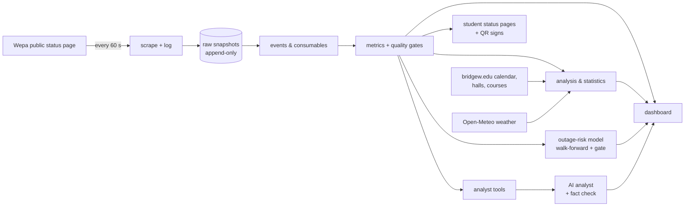

# Case study: BSU Student Printing Ops

*A monitoring and analytics platform for the 31 Wepa print stations at Bridgewater State University.*

## The problem

Students print papers, forms and tickets at Wepa stations in residence halls, the library, labs and the
student union. When one breaks (a jam, an empty tray, a dead drum, a network drop) the student finds
out at the printer, and the support teams (ResNet for residence halls, the IT Service Center for the
rest) find out when someone reports it or on the next walking round.

Wepa publishes a public status page that refreshes every minute, but it only shows *now*. Nobody could
answer: Which printers break most? How long do outages last, and why? Do problems happen when the desk
is closed? Which supplies will we need next month? Where should a student go when their printer is
down?

## Where it started

The first version (2020, `legacy/resnet_wepa_v1.py`) was a terminal script for ResNet Support
Representatives: pick your assigned area, and it polled the status page for those printers and beeped
when one went down. It answered "what's broken right now in my area" and nothing else.

## What it is now

| Layer | What it does | Where |
|---|---|---|
| Collection | Reads the status page every 60 seconds, logs every attempt (success or failure), never edits raw data | `scrape.py`, `collector.py`, `store.py` |
| Modeling | Turns snapshots into outages, faults, paper-tray incidents, consumable usage that survives part replacements | `events.py`, `consumables.py`, `rules.py` |
| Metrics | Documented KPIs with quality gates: availability, repair time, time between failures, usage, data quality | `metrics.py`, README "Metric definitions" |
| Analysis | Report card with workload-adjusted grades; empirical-Bayes failure rates; warning-to-outage; change tests; Monte Carlo supplies and staffing what-ifs; shared-outage detection; busy-weighted downtime; humidity vs jams | `report_card.py`, `advanced.py`, `correlated.py`, `impact.py`, `weather.py` |
| Machine learning | Outage-risk model (logistic regression, gradient-boosted trees, small neural network) that must beat a baseline on walk-forward weeks before it is shown | `risk.py` |
| AI | An analyst agent with read-only tools over all of the above; every figure in its replies is fact-checked against what it was shown | `ai.py`, `analyst.py` |
| Product | Dash dashboard for staff, managers and executives; a student status page per printer with QR signs; exports (CSV, Excel, JSON, PDF) | `dashboard/` |
| Governance | Permanent reference numbers on every outage; Investigations with a governed lifecycle, named accounts, separation of duties, a hash-chained audit trail and PDF evidence packets | `refs.py`, `investigations.py`, `accounts.py`, `docs/INVESTIGATIONS.md` |
| Operations | Azure Container Apps with rolling, zero-downtime deploys; login with lockout; anonymized visit records; CI (lint + tests) | `deploy/`, `security.py`, `.github/workflows/ci.yml` |

## Decisions worth explaining

**Raw data is never edited.** Every metric is recomputed from append-only snapshots, so a corrected
business rule applies to all of history, and every number can be traced back to readings.

**Parse by header, fail loudly.** The scraper finds columns by their header text. If Wepa changes the
page, the attempt is logged as a failure rather than putting values into the wrong fields.

**Small numbers don't get to shout.** A printer with two outages in its first week shouldn't look like
the worst on campus. Report-card ratios, failure rates and the model's history feature are all shrunk
toward the campus rate until a printer has its own history.

**Busy isn't bad.** The report card never penalizes a printer for being used. Faults and parts wear
are judged relative to its workload.

**Models must earn their place.** The outage-risk model is compared with a simple baseline (each
printer's own past rate) on weeks it hasn't seen, trained only on what came before each week. On the
demo data no model beats the baseline, because the simulator's outages are mostly random, and
the dashboard says so instead of showing predictions. A test with a planted pattern confirms that it does
go live when there is something real to learn.

**Statistics that check themselves.** The shared-outage detector's first version flagged three
unrelated noon outages as "very unlikely to be coincidence", because it used the all-day average
rate. It now uses the rate for that hour and weekday/weekend, and refuses to call a group with
unrelated causes "shared". The humidity analysis compares like with like (same time of day) so humid
nights, when nobody prints, aren't mistaken for an effect. Both corrections have tests.

**AI interprets, the app computes.** The AI never calculates. It reads a fact sheet and calls read-only
tools that run the dashboard's own computations. Its instructions limit it to facts, to BSU's printers
and campus, and never to discuss individuals. A checker compares every number in a reply with what the
model was shown; unsupported figures get one rewrite and are then flagged. The annual-report page falls
back to its built-in text rather than publish an unchecked figure.

**Privacy by default.** The data is about printers, never people. Visit records keep only a truncated
network (/24) and never passwords. The student status pages set no cookies and record nothing about
visitors, and they stay behind the login until Wepa and BSU agree to make them public.

## What's real and what's demo

* **Live data** has been collected since October 1, 2026 (first on a laptop, then on Azure). At the time of writing that is days,
  not months, so most findings are still provisional and the dashboard says so.
* **Demo data** is generated by `synth.py` to behave like the real page (four months, 31 stations).
  Screenshots in the README use it and are labeled.

## Results

*To be filled in from the live data, not estimated.* The measurement is already built: record the date
staff started using the dashboard (or any other change, like a new paper vendor or an evening round) in
`reference/changes.csv`, and Analytics → Forecasts & statistics compares before and after
(difference-in-differences against printers the change didn't affect). The planned headline numbers:

* Median and 90th-percentile time to fix an outage, before vs after adoption.
* Share of outages that start after desk hours, and how long they wait.
* Busy-weighted downtime per week.
* The outage-risk model's live track record, once it goes live.

## Engineering

* Python 3.11+, pandas, scipy, scikit-learn, Dash/Plotly, gunicorn; parquet storage.
* Tests: run `pytest` (unit tests for parsing, rules, metrics, statistics, the model's gate, the fact
  checker, the status pages and the login), and CI runs them with `ruff` on every push.
* Deployed on Azure Container Apps with a file share for data; deploys roll over without downtime
  because a new revision waits on the collector's lock before taking over.

## What I'd do next

* Measure and publish the before/after results above.
* Split the dashboard's largest modules and add type checking.
* Add alerts (Teams or email) for after-hours outages and high-risk printers once the model is live.
* With a full semester of minute-level data, try a sequence model as another candidate under the same
  walk-forward test.
